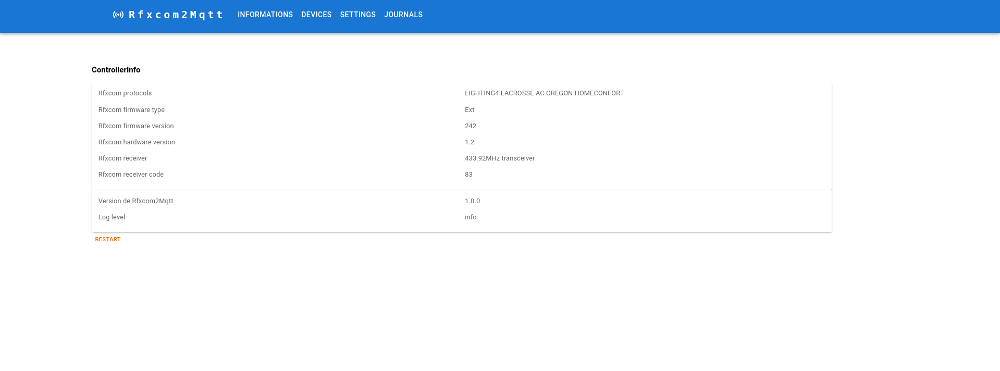
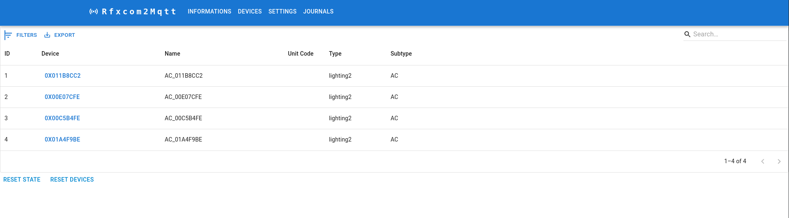
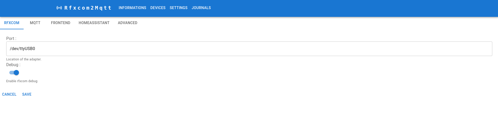

# Frontend

Rfxcom2MQTT has a built-in web-based frontend. 







To enable the frontend add the following to your `configuration.yaml`. This will start the frontend on port `8890`.

```yaml
frontend:
  enabled: true
```


## Advanced configuration

```yaml
frontend:
  enabled: true
  # Optional, empty by default to listen on both IPv4 and IPv6.
  # Don't set this if you use Docker or the Home Assistant add-on unless you're sure the chosen IP is available inside the container
  host: 0.0.0.0
  # Optional, default 8890
  port: 8890
```
