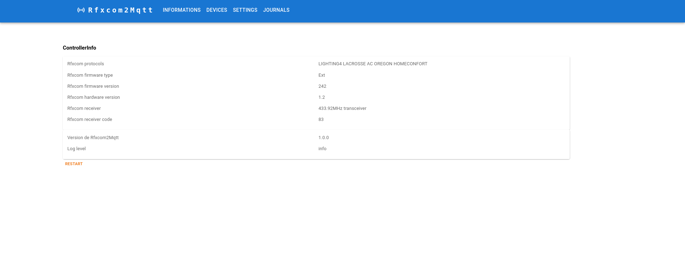
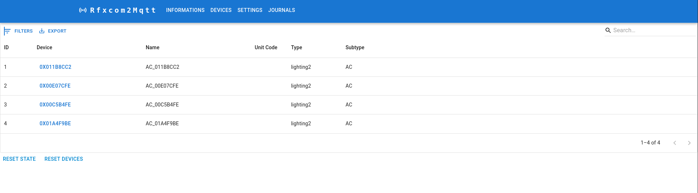
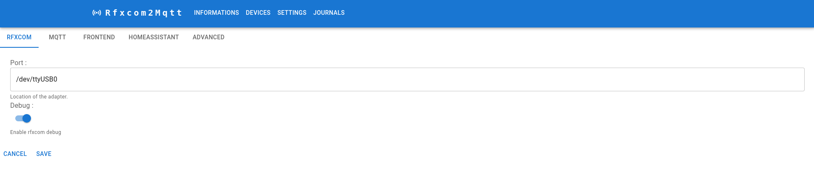

# Usage

This section will guide you through the features and possibilities of Rfxcom2MQTT and how to use them effectively.

## Overview

Rfxcom2MQTT acts as a bridge between your RFXCOM transceiver and your MQTT broker. It allows you to:

1. **Receive RF signals** from various devices and convert them to MQTT messages
2. **Send commands** to RF devices through MQTT
3. **Manage devices** through the web interface
4. **Integrate** with other systems like Home Assistant

Almost any function of Rfxcom2MQTT and its paired devices can be controlled using MQTT. Applications like Home Assistant, Node-RED, and many others provide powerful ways to visualize and implement custom logic for your RF devices.

## Web Interface

If you've enabled the frontend in your configuration, you can access the Rfxcom2MQTT web interface by navigating to `http://your-server-ip:8890` (or the port you configured).

The web interface provides three main sections:

### Bridge

The Bridge section shows information about your RFXCOM transceiver, including:
- Receiver type and frequency
- Hardware and firmware versions
- Enabled protocols
- Transmitter power
- Connection status

### Devices

The Devices section shows all the RF devices that have been detected by Rfxcom2MQTT. For each device, you can:
- See the device type and ID
- View the last received values
- Send commands to the device
- Edit device settings

### Settings

The Settings section allows you to configure various aspects of Rfxcom2MQTT, including:
- MQTT connection settings
- RFXCOM device settings
- Enabled protocols
- Transmitter power
- Home Assistant integration

## Adding New Devices

To add a new device to Rfxcom2MQTT:

1. Make sure your RFXCOM transceiver is properly connected and Rfxcom2MQTT is running
2. Put your device in pairing mode (refer to the device's manual)
3. Trigger the device (press a button, activate a sensor, etc.)
4. Rfxcom2MQTT should detect the device and add it to the list of devices
5. You can then configure the device through the Rfxcom2MQTT frontend or MQTT

## Controlling Devices

You can control your RF devices in several ways:

1. **Through the web interface**: Use the Devices section to send commands directly to your devices
2. **Through MQTT**: Send commands to the appropriate MQTT topics (see [MQTT Topics and Messages](./mqtt_topics_and_messages.md))
3. **Through integrations**: Use integrations like Home Assistant to control your devices

## Further Reading

* [Integrations](./integrations/README.md) - Learn how to integrate Rfxcom2MQTT with other systems
* [Debug](./debug.md) - Troubleshoot issues with Rfxcom2MQTT
* [MQTT Topics and Messages](./mqtt_topics_and_messages.md) - Detailed information about the MQTT topics and messages used by Rfxcom2MQTT
